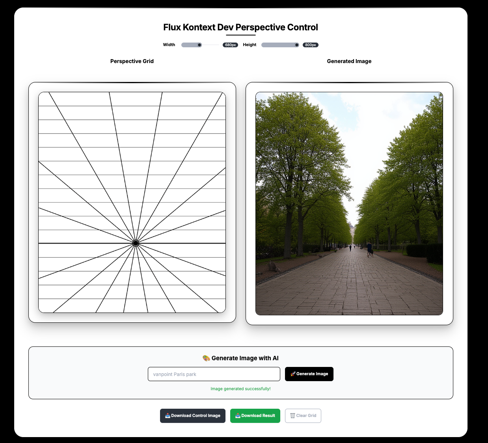

# Kontext Hack - Perspective Grid Generator with AI




A web application that generates perspective grids and uses them to create AI-generated images with proper perspective.

## Lora 
The model can be found: https://huggingface.co/jschoormans/flux-kontext-dev-vanishing-point-lora 

## Training 


Data and vanishing point annotations are from the AVA Dataset, and the authors of:

Detecting Dominant Vanishing Points in Natural Scenes with Application to Composition-Sensitive Image Retrieval  
Zihan Zhou, Farshid Farhat, and James Z. Wang  
IEEE Transactions on Multimedia, 2017. [https://zihan-z.github.io/projects/vpdetection/]

Data here: https://huggingface.co/datasets/jschoormans/perspective_control/upload/main

The LoRa was trained using the AI Toolkit.


## Inference
Trigger word: "vanpoint". Create control images like the ones in the dataset, using the process_vanishing_points.py script or with the interactive web app.


## Web app 


1. Install dependencies:
```bash
npm install
```

2. Create a `.env` file in the root directory with your FAL API key:
```
FAL_KEY=your_fal_key_here
```

3. Start the server:
```bash
npm start
```

4. Open your browser to `http://localhost:3000`

## Usage

1. Click on the canvas to set a vanishing point
2. Enter a prompt in the text field (e.g., "vanpoint cityscape")
3. Click "Generate Image" to create an AI-generated image using your perspective grid
4. Wait for the generation to complete (this may take a few minutes)

## API Endpoints

- `POST /api/generate` - Submit image generation request
- `GET /api/status/:requestId` - Check generation status

## Dependencies

- Express.js for the server
- FAL API for AI image generation
- Custom LoRA model for perspective-aware generation


